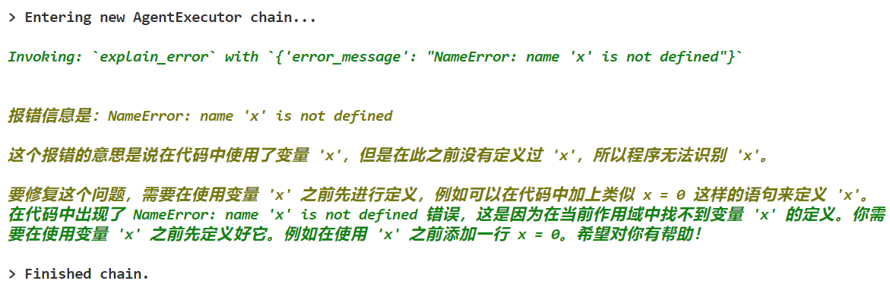

# Agent-Based-Python-TA：基于Agent的Python助教机器人

一个基于 LangChain Agent 和 OpenAI GPT-3.5 的 Python 助教机器人，支持代码检查、报错解释、Python 知识点问答和数学计算功能。


## 项目特点

- **Agent 调用 Tools**：通过 LangChain Agent 动态调用自定义 Tools，实现多任务处理。
- **多轮对话**：支持上下文感知的多轮对话，提升用户体验。
- **知识库检索**：使用 LangChain RAG 和 Chroma 实现知识库问答，确保回答的准确性和相关性。
- **易于扩展**：模块化设计，支持快速添加新的 Tools 或功能。

## 技术栈

- **大模型**：OpenAI GPT-3.5-turbo
- **Agent 框架**：LangChain Agent
- **知识库检索**：LangChain RAG + Chroma
- **后端框架**：FastAPI
- **前端**：HTML + JavaScript

## 快速开始

### 1. 安装依赖
Python 3.10.15，安装依赖：
```bash
pip install -r requirements.txt
```

### 2. 准备 API Key
在项目根目录下创建 `.env` 文件，并填写以下内容：
```plaintext
OPENAI_API_KEY="your_openai_api_key"
OPENAI_BASE_URL="your_openai_base_url"
```

### 3. 构建知识库
运行以下脚本构建知识库：
```bash
python build_knowledge_base.py
```
这会加载知识库文档（chromadb/Python_concept.docx），并将其转换为向量数据库。（你可以替换为自己的知识文档）

### 4. 启动服务
运行以下命令启动 FastAPI 服务：
```bash
python main.py
```
服务启动后，打开浏览器访问 `http://127.0.0.1:8000`，即可使用 Python 助教机器人。

### **关键文件说明**
- **`main.py`**：FastAPI 主程序，包含 Agent 和 Tools 的实现。
- **`build_knowledge_base.py`**：用于构建知识库的脚本，将文档加载并转换为向量数据库。


## 功能列表

1. **代码检查**：检查 Python 代码的语法错误并提供修复建议。  
   <div style="text-align: left;">
       
     
   </div>

2. **报错解释**：用中文解释 Python 报错信息，并提供修复建议。  
   <div style="text-align: left;">
       
     
   </div>

3. **Python 知识点问答**：基于知识库检索，回答 Python 相关问题。  
   <div style="text-align: left;">
       
     
   </div>

4. **数学计算**：支持简单的数学表达式计算。  
   <div style="text-align: left;">
       
     
   </div>


