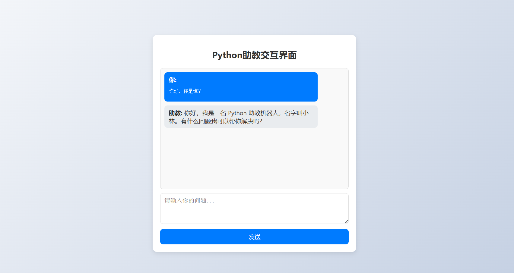
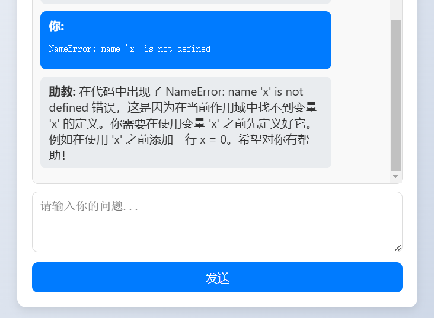
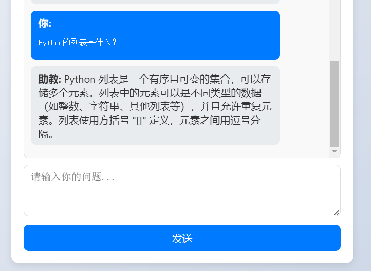
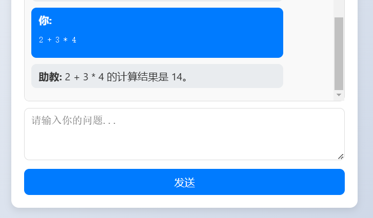

# Agent-Based-Python-TA: A Python Teaching Assistant Robot Based on Agent

A Python teaching assistant robot built with LangChain Agent and OpenAI GPT-3.5, offering features such as code review, error explanation, Python knowledge Q&A, and mathematical calculations.  


## Project Features

- **Agent Calling Tools**: Dynamically invoke custom tools through LangChain Agent for multitasking.
- **Multi-turn Dialogue**: Supports context-aware multi-turn conversations to enhance user experience.
- **Knowledge Base Retrieval**: Utilizes LangChain RAG and Chroma for knowledge base Q&A, ensuring accurate and relevant responses.
- **Easy to Extend**: Modular design allows for quick addition of new tools or features.

## Tech Stack

- **Large Language Model**: OpenAI GPT-3.5-turbo
- **Agent Framework**: LangChain Agent
- **Knowledge Base Retrieval**: LangChain RAG + Chroma
- **Backend Framework**: FastAPI
- **Frontend**: HTML + JavaScript

## Key Files Description

- **`main.py`**: The FastAPI main program, containing the implementation of the Agent and Tools.
- **`build_knowledge_base.py`**: A script for building the knowledge base, loading documents, and converting them into a vector database.

## Quick Start

### 1. Install Dependencies
Python 3.10.15, install dependencies:
```bash
pip install -r requirements.txt
```

### 2. Prepare API Key
Create a `.env` file in the project root directory and fill in the following content:
```plaintext
OPENAI_API_KEY="your_openai_api_key"
OPENAI_BASE_URL="your_openai_base_url"
```

### 3. Build Knowledge Base
Run the following script to build the knowledge base:
```bash
python build_knowledge_base.py
```
This will load the knowledge base document (`chromadb/Python_concept.docx`) and convert it into a vector database. (You can replace it with your own knowledge document.)

### 4. Start the Service
Run the following command to start the FastAPI service:
```bash
python main.py
```
After the service starts, open your browser and visit `http://127.0.0.1:8000` to use the Python teaching assistant robot.

## Feature List

1. **Code Review**: Check Python code for syntax errors and provide fixes.  
   <div style="text-align: left;">
       
     
   </div>

2. **Error Explanation**: Explain Python error messages in Chinese and provide fixes.  
   <div style="text-align: left;">
       
     
   </div>

3. **Python Knowledge Q&A**: Answer Python-related questions based on knowledge base retrieval.  
   <div style="text-align: left;">
       
     
   </div>

4. **Mathematical Calculations**: Supports simple mathematical expression calculations.  
   <div style="text-align: left;">
       
     
   </div>
